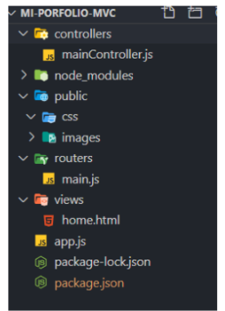

# Trabajo Practico: Patrones de diseño MVC

## Objetivo: 
- Organizar nuestro codigo y mejorar la estreuctura del sitio implementando patrones de diseño como el modelo vista controlador, que nos permite entre otras cosas, estructurar un sitio mas limpio.

### Desafio 1.
- Crearemos un nuevo proyecto basado en la arquitectura MVC, por lo que en un
directorio vacío ejecutaremos el siguiente comando:

                 C:\mi-porfolio-mvc> npm init -y   

## Desafio 2.
- El siguiente paso es instalar Express en nuestro proyecto.

## Desafio 3.
- Dentro del IDE, creamos nuestro punto de acceso, es decir, el archivo app.js. En el mismo indicaremos que utilizaremos Express. 

- En el archivo app.js se agregan las siguientes lineas de codigo:

                 const express = require('express');

                 const app = express();

## Desafio 4.
- Levantar un servidor en el puerto 3000.

## Desafio 5. 
- El siguiente paso es dejar la estructura de nuestro Sitio de la siguiente manera: 

- Para eso nos dejan los siguientes archivos: 

                 https://drive.google.com/file/d/1sUVQCr42quX_vnfg_JjskgFlyjvNSXiu/view

## Desafio 6.
- Crear el sistema de ruteo para renderizar la home.html cuando tipeamos http://localhost:3000/.